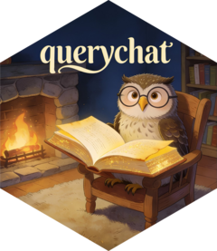
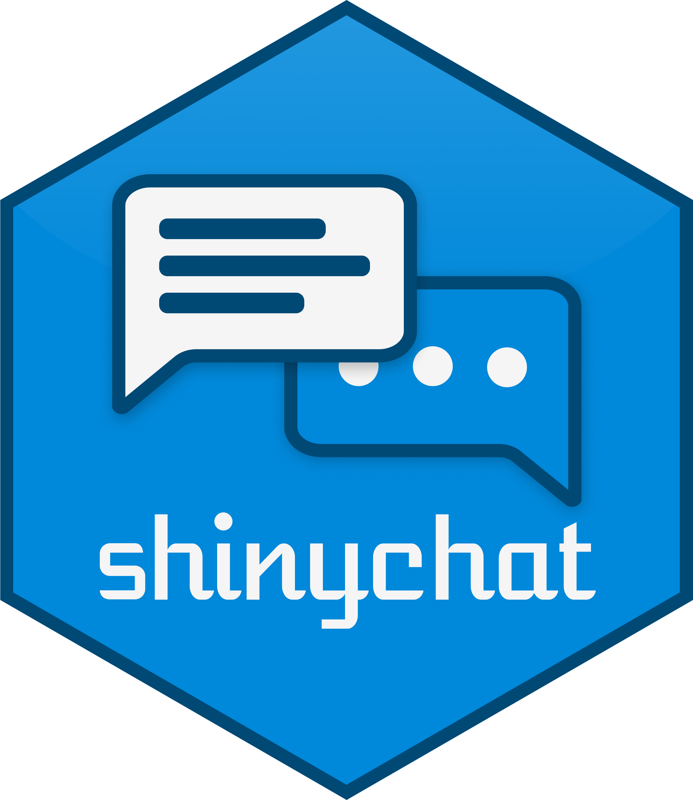

# [querychat]{.hidden} {.no-invert-dark-mode .center background-image="assets/robot-querychat.jpg" background-size="cover" background-position="center"}

## [querychat]{.hidden} {.center .tc}



## Ask questions. Inspect the SQL. {.center}

querychat turns a question about your data into a SQL query, runs the query, and shows the result.

- Ask questions in natural language.
- Inspect the generated SQL.
- See the filtered data in the same app.

The built-in app includes chat, a data table, and a SQL view.

## Start with a data frame {.center}

:::: {.columns}

::: {.column width="50%"}

### R

```{.r code-line-numbers="|3|5|6-7|8|11" fragment-index="1"}

library(ellmer)
library(querychat)

qc <- QueryChat$new(
  airbnb_data,
  "airbnb_data",
  client = chat_posit()
)

qc$app()
```

:::

::: {.column width="50%"}

### Python

```{.python}
import pandas as pd
from chatlas import ChatPosit
from querychat import QueryChat

qc = QueryChat(
    airbnb_data,
    "airbnb_data",
    client=ChatPosit(),
)

app = qc.app()
```

:::

::::

::: notes
When column names need explanation, pass a data dictionary with `data_dict`.
:::

# Your Turn `26_querychat` {.slide-your-turn}

1. Try to reach a conclusion from your earlier Posit Assistant conversation. \
  Ex: _Which neighborhood has the most private rooms?_

1. Open the data drawer and select **Show Query** to inspect the SQL.

1. Restart the app with `data_dict` included. \
   _Among private rooms, which property types are most common?_



::: notes
Students have already explored this dataset with Posit Assistant. Ask them to use QueryChat to reach a conclusion from that conversation.
:::

## {.center .tc transition="fade"}


## {.center .tc transition="fade"}


## {.center .tc transition="fade"}


## querychat in R

```{.r .scrollable code-line-numbers="|4|6|9|14|9,14|16-18"}
library(shiny)
library(bslib)
library(ellmer)
library(querychat)

mtcars_qc <- QueryChat$new(mtcars, client = chat_posit())

ui <- page_sidebar(
  sidebar = mtcars_qc$sidebar(),
  # plots, tables, etc.
)

server <- function(input, output, session) {
  mtcars_qc_vals <- mtcars_qc$server()

  output$table <- renderTable({
    mtcars_qc_vals$df()
  })
}

shinyApp(ui, server)
```

## querychat in Python

```{.python .scrollable code-line-numbers="|2|5-7|10|15|10,15|17-19"}
import polars as pl
import querychat
from chatlas import ChatPosit
from shiny import App, render, ui

mtcars = pl.read_csv("data/mtcars.csv")

mtcars_qc = querychat.QueryChat(mtcars, "mtcars", client=ChatPosit())

app_ui = ui.page_sidebar(
    mtcars_qc.sidebar(),
    # plots, tables, etc.
)

def server(input, output, session):
    mtcars_qc_vals = mtcars_qc.server()

    @render.data_frame
    def data_table():
        return mtcars_qc_vals.df()

app = App(app_ui, server)
```

## Demo: querychat dashboard {.slide-demo .center}

👨‍💻 [_demos/27_querychat]{.code .b .purple}

::: notes
Which neighborhood has the most private rooms?

Among private rooms, which property types are most common?
:::

# [shinychat]{.hidden} {.no-invert-dark-mode .center background-image="assets/robot-aol-chat.png" background-size="cover" background-position="center"}

## [shinychat]{.hidden} {.center .tc}

{style="max-width: 100%; max-height: 500px"}

## Chat can be the application {.center}

`page_chat()` gives a conversation its own page.

It includes conversation history, a chat home, and room for artifacts and other application UI.

::: notes
The earlier word-game app put a chat in a page.

Here, the conversation becomes the page.

The agent and skills are familiar from the Blockbuster activities.

The new work is the application around them.
:::

## Start with `page_chat()` {.center}

:::: {.columns}

::: {.column width="50%"}

### R

```r
ui <- page_chat(
  "Blockbuster renewal assistant",
  id = "chat"
)

server <- function(input, output, session) {
  client <- chat_posit()
  prep_blockbuster_agent(client, ...)
  chat_server("chat", client)
}
```

:::

::: {.column width="50%"}

### Python

```python
app_ui = page_chat(
    "Blockbuster renewal assistant",
    id="chat",
)

def server(input, output, session):
    client = ChatPosit()
    prep_blockbuster_agent(client, ...)
    Chat("chat", client=client)
```

:::

::::

::: notes
`chat_server()` and `Chat(client=...)` provide the chat behavior, including history, streaming, and cancellation.

`prep_blockbuster_agent()` adds the system prompt, tools, and skills from the last exercise.

The client stays visible in the app code.
:::

## Give people a useful start {.center}

A greeting explains the app and can offer prompts they can use or edit.

```markdown
## Welcome to the renewal desk

* <span class="suggestion submit">Draft renewal letters for the top three lapsed members.</span>
* <span class="suggestion submit">List the draft letters already in the workspace.</span>
* <span class="suggestion submit">Explain the renewal-letter skill.</span>
```

::: notes
A `suggestion` fills the chat input.

Add `submit` to send it immediately.

The greeting disappears after the first user message by default.
:::

# Your Turn `24_shinychat-1` {.slide-your-turn}

1. Open the Blockbuster renewal assistant.

1. Add a greeting with three suggestion cards for common renewal tasks.

1. Use a suggestion to draft letters for the top three lapsed members.



::: notes
The agent, its file tools, and the complete skills system are already in `_agent.R` or `_agent.py`.

The visible exercise file is only the chat page and greeting.

The first suggestion should trigger the `renewal-letters` skill.
:::

## Discussion: Did your app...? {.center}

::: incremental
* Give the renewal agent a clear purpose before anyone typed?

* Offer prompts that match the jobs the agent can do?

* Keep the agent tools and skills out of the app code you edited?

* Preserve the conversation after you followed a suggestion?
:::

::: notes
The main point is composition.

A complete chat application can remain small when the agent implementation lives behind a compact interface.

Ask whether the prefilled prompt needed editing before it was sent.
:::

## Artifacts stay beside the conversation {.center}

A drawer can hold the drafts an agent creates.

The user can select a letter, edit it in a code editor, and save it to the workspace.

::: notes
The code editor is an input.

Its value reaches the server when the user leaves the editor or presses Ctrl/Cmd+Enter.

The save button writes that value to the selected draft.
:::

## Tools can control the app {.center}

When the agent writes or edits a letter, it calls `show_letter()`.

`show_letter()` selects that file in the drawer and opens it for the person to review.

::: notes
This is a normal model tool, but its side effect is in the Shiny interface.

The model still uses `write_file()` and `edit_file()` from the earlier agent exercises.

New drafts use names such as `elaine-wu-v1.md` and `elaine-wu-v2.md`.
:::

# Your Turn `25_shinychat-2` {.slide-your-turn}

1. Complete `show_letter()` so it selects a draft and opens the letter drawer.

1. Ask the agent to draft a renewal letter for Elaine Wu.

1. Edit the letter in the drawer, save it, then ask the agent to revise that draft.



::: notes
The supplied reactive timer keeps the draft picker current.

`show_letter()` should validate the requested filename, update the `letter` input, show the drawer, and report what it opened.

The model is instructed to call it after it writes or edits a draft.
:::

## Discussion: Did your agent...? {.center}

::: incremental
* List the drafts before it created a new version?

* Write a draft named `elaine-wu-v1.md` or the next available version?

* Open the letter it wrote in the drawer?

* Preserve your edit when you saved it?

* Read the current letter before it tried to edit it?
:::

::: notes
The final question is deliberately not a requirement in the system prompt.

Ask people to inspect the trace and consider what happens when a person and an agent edit the same file.

The app has separate state in the conversation, the selected draft, the editor, and the workspace.

This is a small example of a much larger application-design problem.
:::
