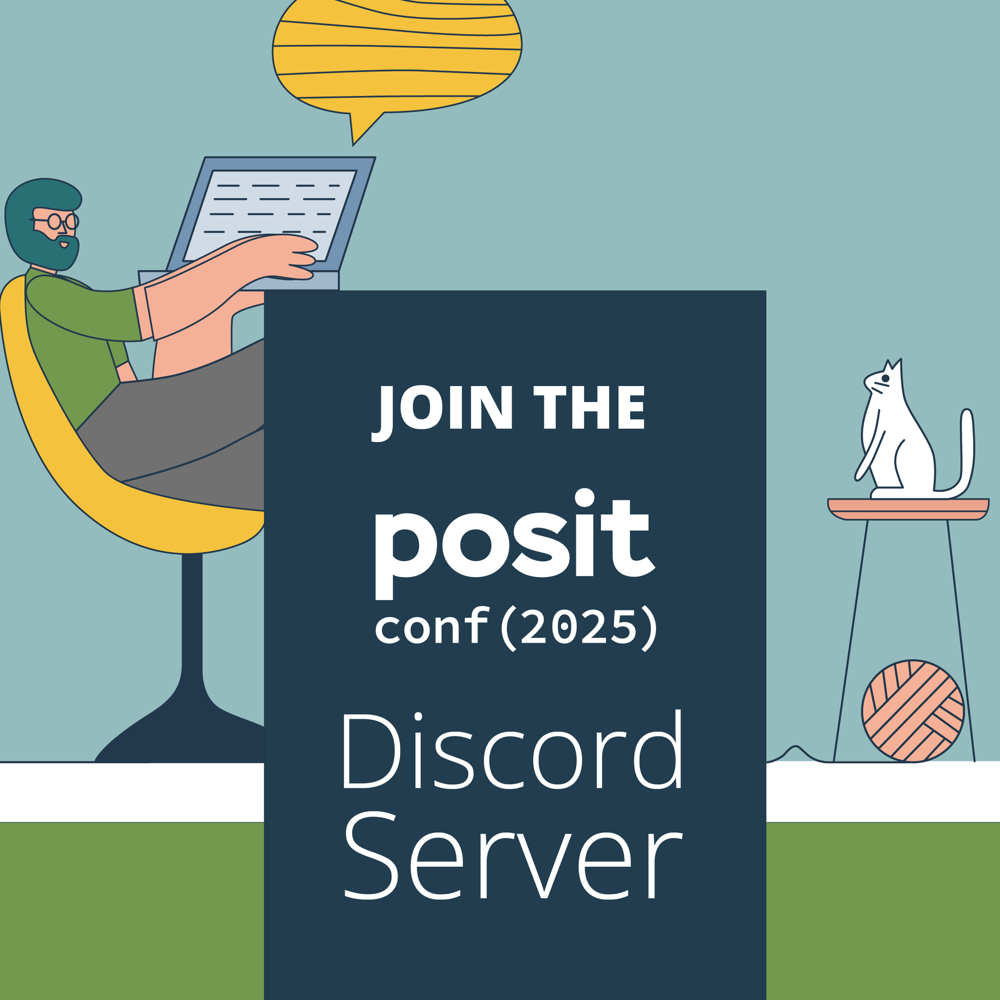
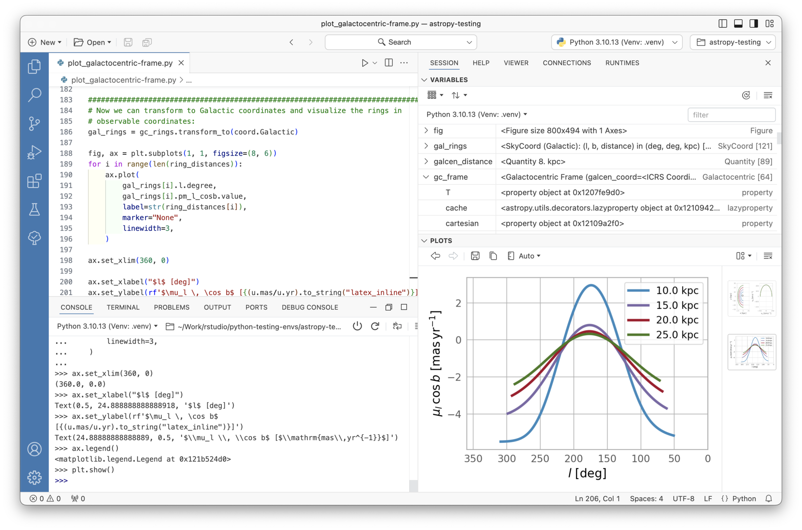

## Welcome to [Programming&nbsp;with&nbsp;LLM&nbsp;APIs&nbsp;]{.dark-blue}! {.fs-step-2 background-image="assets/retro-mac.jpg" background-size="cover" background-position="bottom left"}

* Find a seat where you can see the screen!

* Update your local copy of the workshop: \
  [posit-conf-2026.github.io/llms/setup.html]{.code .b .orange}

* Join the Discord: [pos.it/joinconf26](https://pos.it/joinconf26){.code .orange .b}

* [wifi(<br>&nbsp;&nbsp;network="",<br>&nbsp;&nbsp;password=""<br>)]{.code}

* Conference details: [conf.posit.co/2026]{.code .orange .b}

```{=html}
<style>
.reveal .footer {
  font-size: 0.5em !important;
}
</style>
```

# 🤝 Introductions 🤝 {.middle}

## Meet us {.center .text-center}

**Instructors**

Garrick Aden-Buie and Sara Altman

**Teaching assistants**

Kristin Bott, Alex Chisholm, and Carson Sievert

## Code of Conduct

**Please Review:** [posit.co/code-of-conduct](https://posit.co/code-of-conduct/)

💙 Treat everyone with respect \
🧡 Everyone should feel welcome and safe

**Reporting:**

🗣️ any posit::conf staff member (t-shirt) or Info desk \
📧 `codeofconduct@posit.co`

## Meet each other

* 👋 Hi, my name is ...

* 🤖 I'd call myself an AI... [\[skeptic, pragmatist, enthusiast\]]{.gray}

* ⚡ Share a moment when AI surprised you

# About posit::conf(2026)

## Wi-Fi {.text-center .center}

[wifi("", password="")]{.code .f1}

## posit::conf(2026) Things to Know

::: incremental
*  🚻 **Gender-neutral bathroom**: _____

*  🧘 **Meditation/prayer room**: _____

*  🤱 **Lactation room**: _____

*  🎉 **Welcome reception**: _____

:::

## posit::conf(2026) Social Media

* [Red lanyards]{.red .b} available to those who don't wish to be photographed

* Conference hashtag: `TODO`

## Conference details {.center .text-center}

**September 14-16, 2026**

Hilton Americas-Houston

[conf.posit.co/2026](https://conf.posit.co/2026/)

## [Questions]{.hidden} {.center}

::: {.text-center style="font-size: 3em"}
🙋 🙋‍♀️ 🙋‍♂️ \
Please ask questions!
:::

# About this workshop

## 🏡 [posit-conf-2026.github.io/llms]{.code} {.center .text-center}

Everything you need, in one place.

## Discord

::: {.easy-columns .items-center}
::: col
1. Open [pos.it/joinconf26](https://pos.it/joinconf26)
1. Accept the Discord invitation
1. Set your display name to the name you used to register
1. Join us in []{.code .purple}
:::
::: text-center
{style="max-height: 80vh"}
:::
:::

## Schedule



## Schedule (the important bits)

::: {.table-highlight-even}

:::


## Stickies {.center .text-center}

::: {.easy-columns style="font-size: 1.5em;"}
::: {.flex .flex-column .items-center .justify-center .text-center}
[🟩]{style="font-size: 2em"}

All good \
I'm done
:::
::: {.flex .flex-column .items-center .justify-center .text-center}
[🟥]{style="font-size: 2em"}

Not great \
Need time or help
:::
:::


# Computering {.middle .text-center}

## Setup

1. Head to [posit-conf-2026.github.io/llms/setup.html](https://posit-conf-2026.github.io/llms/setup.html)

2. Clone our workshop repo `posit-conf-2026/llms`

3. Open the project in **Positron**

4. Install all the packages:

    * R: `renv::restore()`
    * Python: `uv sync`

## We're using Positron

::: text-center
{style="max-height: min(650px, 80vh)"}
:::

::: footer
RStudio and VS Code are great, too!
:::


<!-- TODO: Cloud project instructions here -->

## File organization

::: {.table-no-border style="--row-padding: 0.5em;"}
|  |  |
|:---|:------------|
| `_exercises/` | Files for **Your Turn** exercises |
| `_solutions/` | Solutions to those exercises |
| `_demos/` | Files for stuff we demo |
| `website/` | The website and slides |
| `./*` | Lots of project related files you can ignore |
:::

## Exercise Solutions

::: {.flex .flex-column .justify-center-ns .items-center-ns style="min-height: 20vh"}
👨‍💻 👩‍💻 `_exercises/01_hello-llm/01_hello-llm.R` \
[&nbsp;&nbsp;&nbsp;🫣&nbsp;&nbsp;&nbsp; `_solutions/01_hello-llm/01_hello-llm.R`]{.fragment}
:::

::: {.fragment .flex .flex-column .justify-center-ns .items-center-ns}
**Also in Python:** \
👨‍💻 👩‍💻 `_exercises/01_hello-llm/01_hello-llm.py` \
&nbsp;&nbsp;&nbsp;📓&nbsp;&nbsp;&nbsp; `_exercises/01_hello-llm/01_hello-llm.pynb` \
&nbsp;&nbsp;&nbsp;🫣&nbsp;&nbsp;&nbsp; `_solutions/01_hello-llm/01_hello-llm.py`
:::

# Let's Dive In!

::: fragment
..to our first activity!
:::

## To use an AI API... {.center}

::: {.fragment style="font-size: 2em;"}
...you need an API key!
:::

## How to get an API key, the usual way {.center}

[aka. how to give OpenAI your money]{.i .gray}

::: {.incremental .mt4}
1. 🆙 Sign up for an account with [OpenAI](https://platform.openai.com/) or [Anthropic](https://www.anthropic.com/)

2. 💳 Add a payment method

3. 🔑 Get an API key

4. 💾 Store it in `.Renviron` or `.env` file<br>as `OPENAI_API_KEY` or `ANTHROPIC_API_KEY`
:::

## But we'll give you API keys to use today! {.center}

::: incremental
1. Use these keys for all of our activities today

2. Play and explore! But please be considerate :)

3. We'll turn them off at the end of the workshop
:::

## Your Turn `01_hello-llm` {background-image="assets/your-turn.png" background-size="30%" background-position="bottom right"}

::: {style="--li-margin: 0.66em;"}
1. 🔓 Decrypt the `.env.secret` &rarr; `.env`:
    a. **R**: Run [secret.R]{class="b--light-red red ph2 pv1 ba br2 code"}

    b. **Python:** Run [make secret-decrypt]{class="b--blue blue ph2 pv1 ba br2 code"} in terminal \
      or run [uv run secret.py decrypt .env.secret > .env]{class="b--blue blue ph2 pv1 ba br2 code"}

2. 🤫 The special phrase is: \
   [positconf2026-llms-workshop]{class="b--purple purple ph2 pv1 ba br2 code" contenteditable="true" style="font-size: 1.25em"}

3. 🤖 Run the code in [_exercises/01_hello-llm]{.b}
:::
