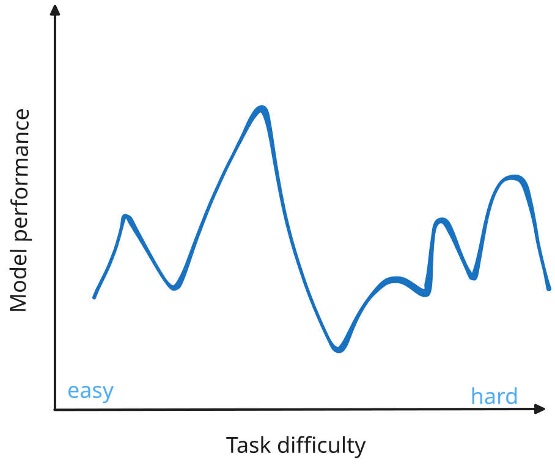
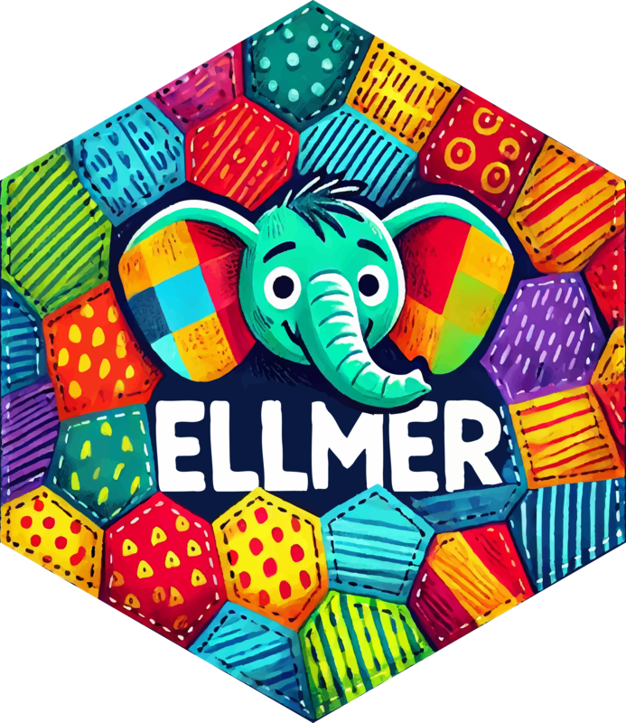
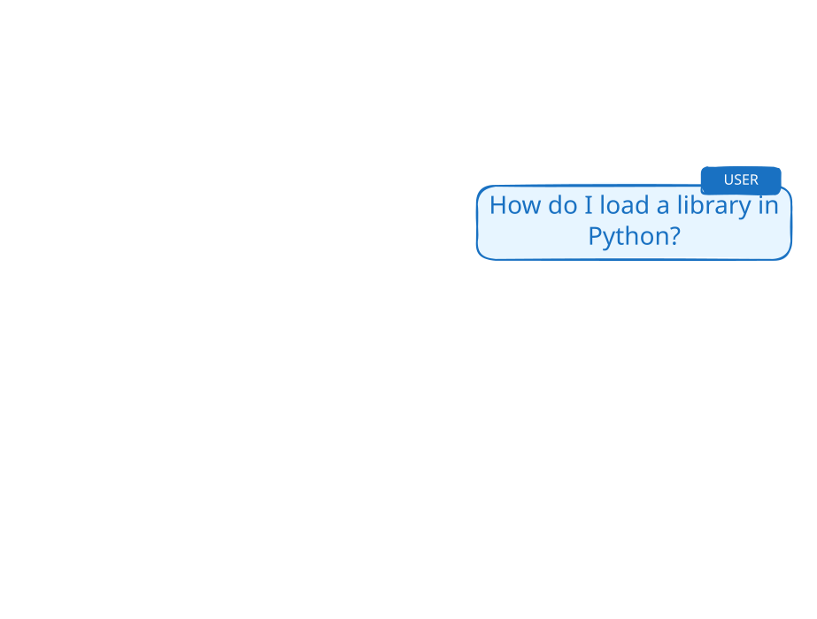
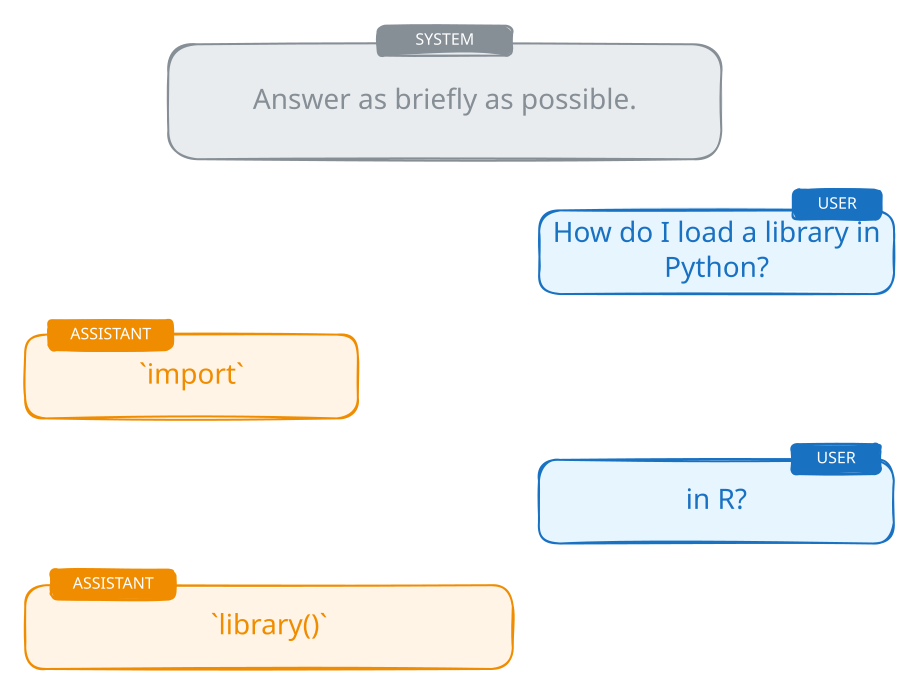

# How to think about LLMs {.dark-blue background-image="assets/retro-mac.jpg" background-size="cover" background-position="bottom left"}

```{r}
source(here::here("website/slides/_incremental_slides.R"))
```

::: notes
Some motivational words by Joe urging everyone to approach LLMs with curiosity and experimentation rather than preconceived notions about limitations, while building understanding from the ground up through practical experience.
:::

## Think Empirically, Not Theoretically {.center .text-center}

## Think Empirically, Not Theoretically {.center .text-center}

- It's okay to (mostly) treat LLMs as **black boxes**. \
  We're not going to focus on how they work internally

- **Just try it!** When wondering if an LLM can do something,\
  experiment rather than theorize

- You might think they could not possibly do things\
  _that they clearly can do today_

- And you might think _surely_ they can do something\
  that it turns out they're _terrible_ at

::: notes
- Understanding the technical details can lead to **bad intuition** about capabilities
- You might think "they could not possibly do things that they clearly can do today"
- Empirical testing reveals actual capabilities vs. theoretical limitations
:::

## {.center}

::: notes
Don't expect smooth, predictable performance across tasks. LLMs can surprise you - excelling at some complex tasks while struggling with seemingly simple ones.
:::

{style="max-width: 90%; max-height: 550px; display: block; margin-left: auto; margin-right: auto;"}

## LLMs are jagged {.center}

{style="max-width: 90%; max-height: 550px; display: block; margin-left: auto; margin-right: auto;"}

## [Embrace the Experimental Process]{.dib .bg-black .ph4 .white} {.center .text-center background-image="assets/national-cancer-institute-Okk-eID2Z9k-unsplash.jpg" background-size="cover" background-position="center"}

::: {.footer style="color: rgba(255,255,255,0.5);"}
Photo by <a href="https://unsplash.com/@nci?utm_source=unsplash&utm_medium=referral&utm_content=creditCopyText" style="color: rgba(255,255,255,0.5);">National Cancer Institute</a> on <a href="https://unsplash.com/photos/Okk-eID2Z9k?utm_source=unsplash&utm_medium=referral&utm_content=creditCopyText" style="color: rgba(255,255,255,0.5);">Unsplash</a>
:::

::: notes
We will talk about ways to formally run experiments in the next section.
:::

## Start Simple, Build Understanding {.center .text-center}

## Start Simple, Build Understanding {.center .text-center}

- We're going to focus on the **core building blocks**.

- All the incredible things you see AI do \
  **decompose to just a few key ingredients**.

- Our goal is to **have fun and build intuition** \
  through hands-on experience.

::: notes
- Think **very generally** about what tools can do - they're as powerful as any software you can write
- Remember: **"Everything decomposes"** to the basic components once you understand the underlying APIs
- Build intuition through hands-on experience rather than theoretical study
- We want to have fun in this course! It's worth saying up front that our examples are not necessarily practical, but they're full of practical lessons.
:::


# [Anatomy of a Conversation]{.white} {.no-invert-dark-mode background-image="assets/jaroslaw-glogowski-oAYKzeP0qF4-unsplash.jpg" background-size="cover" background-position="left 30%"}

::: {.footer style="color: rgba(255,255,255,0.5);"}
Photo by <a href="https://unsplash.com/@jglogowski?utm_source=unsplash&utm_medium=referral&utm_content=creditCopyText" style="color: rgba(255,255,255,0.5);">Jaroslaw Glogowski</a> on <a href="https://unsplash.com/photos/oAYKzeP0qF4?utm_source=unsplash&utm_medium=referral&utm_content=creditCopyText" style="color: rgba(255,255,255,0.5);">Unsplash</a>
:::

## {.center}


{.fragment}

::: notes
Those conversations often look something like this:

You ask a question and ChatGPT responds.
You can keep talking to ChatGPT and it keeps responding,
almost like you're having a conversation with a person.

We can do the same thing from R and Python.
:::

## We can do this from R and Python!

::: {.easy-columns}
::: tc
{style="max-width: 100%; max-height: 500px"}

**R**
:::

::: tc
{style="max-width: 100%; max-height: 500px"}

**Python**
:::
:::

## A complete example

::: {style="--code-font-size: 0.82em"}
[{height="24px" alt="R"} ellmer]{.flex .items-center .gap-1}

```r
library(ellmer)

chat <- chat_posit()

chat$chat("Tell me a fact about cats.")
```

::: fragment
```text
#> **Cats can't taste sweetness.**
#> They lack the specific taste receptor gene
#> (Tas1r2) that allows most mammals to
#> detect sugary flavors.
```
:::
:::

::: notes
You just saw a conversation in a chat UI. This is the same basic interaction
from R.

At a high level, this loads a package, creates a chat client, and sends it a
message.
:::

## A complete example {transition="fade"}

::: {style="--code-font-size: 0.82em"}
[{height="24px" alt="Python"} chatlas]{.flex .items-center .gap-1}

```python
import chatlas

chat = chatlas.ChatPosit()

chat.chat("Tell me a fact about cats.")
```

::: fragment
```text
#> **Cats can't taste sweetness.**
#> They lack the specific taste receptor gene
#> (Tas1r2) that allows most mammals to
#> detect sugary flavors.
```
:::
:::

::: notes
The same three steps work in Python: import a package, create a chat client,
and send it a message.
:::

## How does this work?

Most LLMs are accessible through HTTP APIs

::: notes
This is pretty much a normal API. If you have queried an API to get data, this
is fundamentally the same thing.
:::

## 

::: notes
Talking to an LLM like ChatGPT happens through HTTP requests and responses.
When you send a message, the chat client sends a POST request. The server runs
the model, then returns the response.
:::

```{r}
#| output: asis

incremental_slides(
  pattern = "intro-conversation-api-.+[.]svg$",
  template = r"(::: {{.mt6}}

:::)",
  collapse = "\n\n## \n\n"
)
```

## {transition="fade"}

::: {.easy-columns .smaller style="--code-font-size: 0.66em"}
::: col
[{height="24px" alt="R"} ellmer]{.flex .items-center .gap-1}

```{.r code-line-numbers="1"}
library(ellmer)
```
:::

::: col
[{height="24px" alt="Python"} chatlas]{.flex .items-center .gap-1}

```{.python code-line-numbers="1"}
import chatlas
```
:::
:::

## {transition="fade"}

::: {.easy-columns .smaller style="--code-font-size: 0.66em"}
::: col
[{height="24px" alt="R"} ellmer]{.flex .items-center .gap-1}

```{.r code-line-numbers="3"}
library(ellmer)

chat <- chat_posit()
```
:::

::: col
[{height="24px" alt="Python"} chatlas]{.flex .items-center .gap-1}

```{.python code-line-numbers="3"}
import chatlas

chat = chatlas.ChatPosit()
```
:::
:::

## {transition="fade"}

::: {.easy-columns .smaller style="--code-font-size: 0.66em"}
::: col
[{height="24px" alt="R"} ellmer]{.flex .items-center .gap-1}

```{.r code-line-numbers="5"}
library(ellmer)

chat <- chat_posit()

chat$chat("Tell me a fact about cats.")
```
:::

::: col
[{height="24px" alt="Python"} chatlas]{.flex .items-center .gap-1}

```{.python code-line-numbers="5"}
import chatlas

chat = chatlas.ChatPosit()

chat.chat("Tell me a fact about cats.")
```
:::
:::

## 

::: {style="--code-font-size: 0.56em"}
[{height="24px" alt="R"} ellmer]{.flex .items-center .gap-1}

```r
chat
```
```{.markdown code-line-numbers="|2|2,4"}
<Chat Posit turns=2>
── user ─────────────────────────────────────────────
Tell me a fact about cats.
── assistant ────────────────────────────────────────
Cats have a special reflective layer behind their retinas that
helps them see in very low light.
```

::: fragment
[{height="24px" alt="Python"} chatlas]{.flex .items-center .gap-1}

```python
print(chat)
```
```{.markdown code-line-numbers=false}
## User turn:

Tell me a fact about cats.

## Assistant turn:

Cats have a special reflective layer behind their retinas that
helps them see in very low light.
```
:::

:::

::: {.fragment .absolute top=100 right=50 class="w-50 ba b--dark-teal bg-washed-green dark-green pa3 br2 flex items-start tl"}
Messages have **roles**.
:::

::: notes
The chat objects contain the conversation history. What do you notice?

Each message has a role. The user supplies a prompt, and the assistant supplies
the model's response.
:::

## Messages have roles

{style="max-width: 90%; max-height: 550px; display: block; margin-left: auto; margin-right: auto;"}

## Messages have roles

{style="max-width: 90%; max-height: 550px; display: block; margin-left: auto; margin-right: auto;"}

## Messages have roles

{style="max-width: 90%; max-height: 550px; display: block; margin-left: auto; margin-right: auto;"}

## Messages have roles

{style="max-width: 90%; max-height: 550px; display: block; margin-left: auto; margin-right: auto;"}

## Message roles

| Role        | Description                                                       |
|:-----------|:------------------------------------------------------------------|
| <code style="color: #868e96 !important">system_prompt</code> | Instructions from the developer that set the behavior of the assistant |
| <code style="color: #1971c2 !important">user</code>       | Messages from the person interacting with the assistant          |
| <code style="color: #f08c00 !important">assistant</code>  | The AI model's responses to the user                              |

## System prompts {transition="fade"}

::: {.easy-columns .smaller style="--code-font-size: 0.56em"}
::: col
[{height="24px" alt="R"} ellmer]{.flex .items-center .gap-1}

```{.r code-line-numbers="3-6"}
library(ellmer)

chat <- chat_posit(
  system_prompt = "Answer in haikus."
)

chat$chat("Tell me a fact about sheep.")
```
:::

::: col
[{height="24px" alt="Python"} chatlas]{.flex .items-center .gap-1}

```{.python code-line-numbers="3-6"}
import chatlas

chat = chatlas.ChatPosit(
    system_prompt="Answer in haikus."
)

chat.chat("Tell me a fact about sheep.")
```
:::
:::

## System prompts {transition="fade"}

::: {.easy-columns .smaller style="--code-font-size: 0.52em"}
::: col
[{height="24px" alt="R"} ellmer]{.flex .items-center .gap-1}

```{.r code-line-numbers="8-11"}
library(ellmer)

chat <- chat_posit(
  # Set the response style
  system_prompt = "Answer in haikus."
)

chat$chat("Tell me a fact about sheep.")
#> Woolly white cloud grows
#> Sheep never sleep flat on ground
#> Fear keeps them standing.
```
:::

::: col
[{height="24px" alt="Python"} chatlas]{.flex .items-center .gap-1}

```{.python code-line-numbers="8-11"}
import chatlas

chat = chatlas.ChatPosit(
    # Set the response style
    system_prompt="Answer in haikus."
)

chat.chat("Tell me a fact about sheep.")
#> Woolly white cloud grows
#> Sheep never sleep flat on ground
#> Fear keeps them standing.
```
:::
:::

## The chat object {transition="fade"}

::: {.easy-columns .smaller style="--code-font-size: 0.46em"}
::: col
[{height="24px" alt="R"} ellmer]{.flex .items-center .gap-1}

```r
chat
```
```{.markdown code-line-numbers=false}
<Chat Posit turns=3>
── system ─────────────────────────
Answer in haikus.
── user ───────────────────────────
Tell me a fact about sheep.
── assistant ──────────────────────
Woolly white cloud grows
Sheep never sleep flat on ground
Fear keeps them standing.
```
:::

::: col
[{height="24px" alt="Python"} chatlas]{.flex .items-center .gap-1}

```python
print(chat)
```
```{.markdown code-line-numbers=false}
## System turn:
Answer in haikus.

## User turn:
Tell me a fact about sheep.

## Assistant turn:
Woolly white cloud grows
Sheep never sleep flat on ground
Fear keeps them standing.
```
:::
:::


# Your Turn `02_conversation` {.slide-your-turn}

1. Set up a `chat` with this system prompt:

   > Answer in as few words as possible.

1. **Ask:** _What ellmer and chatlas functions create an Anthropic chat?_

1. **Ask:** _What about OpenAI?_

5. Then, create a new `chat` with no system prompt and ask only the second question: _What about OpenAI?_

5. How do the answers to 3 and 4 differ? Why?

# Demo: `clearbot` {.slide-demo style="--code-font-size: 0.66em"}

👨‍💻 [_demos/03_clearbot/app.py]{.code .b .purple}

**System prompt:**

```{.markdown code-line-numbers=false}
Answer in as few words as possible.
```

**First question:**

```{.markdown code-line-numbers=false}
What ellmer and chatlas functions create an Anthropic chat?
```

**Second question:**

```{.markdown code-line-numbers=false}
What about OpenAI?
```

# [How to talk to robots]{.dib .bg-black .ph4 .white style="position: relative; top: -3em;"} {.no-invert-dark-mode background-image="assets/andy-kelly-0E_vhMVqL9g-unsplash.jpg" background-size="cover" background-position="center"}

::: {.footer style="color: rgba(255,255,255,0.5);"}
Photo by <a href="https://unsplash.com/@askkell?utm_source=unsplash&utm_medium=referral&utm_content=creditCopyText" style="color: rgba(255,255,255,0.5);">Andy Kelly</a> on <a href="https://unsplash.com/photos/0E_vhMVqL9g?utm_source=unsplash&utm_medium=referral&utm_content=creditCopyText" style="color: rgba(255,255,255,0.5);">Unsplash</a>
:::

## {.center}


{.fragment}

::: notes
Those conversations often look something like this:

You ask a question and ChatGPT responds.
You can keep talking to ChatGPT and it keeps responding,
almost like you're having a conversation with a person.
:::

## [Is this actually a conversation?]{.dib .bg-black .ph4 .white} {.no-invert-dark-mode background-image="assets/marija-zaric-wFWXRDilwKo-unsplash.jpg" background-size="cover" background-position="center"}

::: {.footer style="color: rgba(255,255,255,0.5);"}
Photo by <a href="https://unsplash.com/@simplicity?utm_source=unsplash&utm_medium=referral&utm_content=creditCopyText" style="color: rgba(255,255,255,0.5);">Marija Zaric</a> on <a href="https://unsplash.com/photos/wFWXRDilwKo?utm_source=unsplash&utm_medium=referral&utm_content=creditCopyText" style="color: rgba(255,255,255,0.5);">Unsplash</a>
:::

::: notes
But this is not a conversation.

It certainly _feels_ like a conversation,
but something else is happening behind the scenes.
:::

## LLMs are stateless {.center}

::: incremental
- The LLM doesn't remember anything between requests

- You have to send the **entire conversation history** with every message

- The LLM reconstructs the "conversation" from what you send
:::

::: notes
The LLM has amnesia - it forgets everything after each response. Each API request is completely independent.

Just like if you were talking to someone with amnesia, you have to recap the entire conversation every time you want to continue. That's what clearbot showed you - the full history being sent with each request.

This isn't a limitation of transformers specifically - it's how the HTTP API is designed. Though it aligns with how transformers work (each forward pass is independent).
:::

## ChatGPT {.center}

::: r-fit-text
**Chat**ting with a **G**enerative **P**re-trained **T**ransformer
:::

::: {.fragment .r-fit-text}
**LLM** &rarr; **L**arge **L**anguage **M**odel
:::

::: notes
GPT is a type of LLM, but not all LLMs are GPTs.

LLM: Deep learning on huge amounts of text data to understand and generate human language.
GPT: Specific architectural design of LLMs.

From now on, we'll use **LLM** to refer to any large language model.
:::

## How to make an LLM {.center}

::: {.columns}
::: {.column}
**If you read everything<br>ever written...**

* Books and stories

* Websites and articles

* Poems and jokes

* Questions and answers
:::
::: {.column .fragment}
<br>**...then you could...**

- Answer questions
- Write stories
- Tell jokes
- Explain things
- Translate into any language
:::
:::


## The cat sat in the ____ {.center}

::: incremental
::: {.columns style="font-size: 6rem;"}
::: {.column}
* 🎩
* 🛌
* 📦
:::
::: {.column}
* 🪟
* 🛒
* 👠
:::
:::
:::

::: notes
The breakthrough insight is the attention mechanism in the Transformer architecture.
Instead of processing text sequentially (word by word),
GPT models can look at all words in a sequence simultaneously
and understand how they relate to each other.

The attention mechanism allows the model to:

* Weigh the importance of every word in relation to every other word
* Capture long-range dependencies that traditional models missed
* Process sequences in parallel rather than sequentially
:::

## Actually: tokens, not words {.center}

::: {.incremental}
- Fundamental units of information for LLMs
- Words, parts of words, or individual characters
  - "hello" → 1 token
  - "unconventional" → 3 tokens: `un|con|ventional`
- Important for:
  - Model input/output limits
  - [API pricing](https://llmpricecheck.com/calculator/) is usually by token
- Not just words, but images can be tokenized too
:::

## {background-image="assets/token-approximations.png" background-size="contain" visibility="hidden"}

::: footer
<https://llm-stats.com/>
:::

::: notes
The newest and biggest models from OpenAI and Google
can handle 1 million input tokens at once.

Which is kind of like saying that you could paste

* 30 hours of podcasts
* 1,000 pages of a book
* 60,000 lines of code

into the chat window and the model could "pay attention" to it all.

1M is the upper limit currently, most models accept up to around 200k tokens.
:::


# Demo: <br> `token-possibilities` {.slide-demo style="--code-font-size: 0.66em"}

👨‍💻 [_demos/04_token-possibilities/app.R]{.code .b .purple}

# [Programming is fun, but I kind of like ChatGPT...]{.bg-white .f1 .normal .relative style="top: -14px"} {background-image="assets/shinychat-input-empty.png" background-size="contain" background-position="center"}

# [ellmer and chatlas can do that, too!]{.bg-white .f1 .normal .relative style="top: -14px"} {background-image="assets/shinychat-input-focused.png" background-size="contain" background-position="center"}

## {.center}

::: {.table-no-border}
| | Console | Browser |
|:---:|:---:|:---:|
| {height="4em" alt="ellmer"} | `live_console(chat)` | `live_browser(chat)` |
| {height="4em" alt="chatlas"} | `chat.console()` | `chat.app()` |

: {tbl-colwidths="[20,40,40]"}
:::

::: notes
As we'll see, everything we're going to do today can be done
in either R or Python and ellmer and chatlas are designed to be similar.

But they're in different languages and those languages have different
conventions and idioms, so they're not completely identical. If they were,
one or the other would start to feel unnatural to use.
:::

# Your Turn `05_live` {.slide-your-turn}

::: {style="--li-margin: 0.66em;"}
1. Your job: write a groan-worthy roast of Hadley Wickham

2. Bonus points for puns, rhymes, and one-liners

3. Don't be mean

4. Share your best with a neighbor.
:::



# [shinychat]{.hidden} {.no-invert-dark-mode background-image="assets/shinychat-robot2.png" background-size="cover" background-position="center"}

## A quick chat app in R {style="--code-font-size: 0.8em"}

```{.r}
library(ellmer)
library(shinychat)

client <- chat_posit()
chat_app(client)
```

::: notes
`chat_app()` gives you an immediately usable chat application around an
`ellmer` chat client. It is meant for a single person using it interactively.
:::

## A chat app in R {style="--code-font-size: 0.6em"}

For an app other people can use, create one client per session.

```{.r}
library(shiny)
library(ellmer)
library(shinychat)

ui <- page_chat(
  "My chat"
)

server <- function(input, output, session) {
  client <- chat_posit()
  chat_server("chat", client)
}

shinyApp(ui, server)
```

::: notes
`chat_server()` handles user input, streaming, cancellation, attachments, and
conversation history. The client must be created inside `server()` so each
visitor gets their own conversation.
:::

## A chat app in Python {style="--code-font-size: 0.56em"}

```{.python}
import chatlas
from shiny import App, ui
from shinychat import Chat, chat_ui

app_ui = ui.page_fillable(
    chat_ui("chat")
)

def server(input, output, session):
    client = chatlas.ChatPosit()
    chat = Chat("chat", client=client)

app = App(app_ui, server)
```

::: notes
Passing `client=` gives `Chat` the same batteries-included behavior as
`chat_server()` in R, including the submit handler and streaming response.
:::

# Your Turn `06_word-games` {.slide-your-turn}

1. I've set up the basic Shiny app snippet and a system prompt.

2. Your job: create a chatbot that plays a "20 questions" style word guessing game with you.

3. The model comes up with a word, and it's your job to guess the word. 


