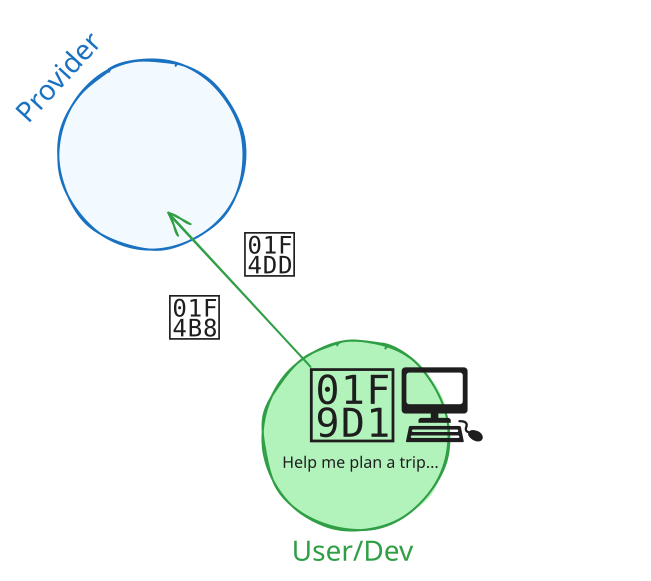
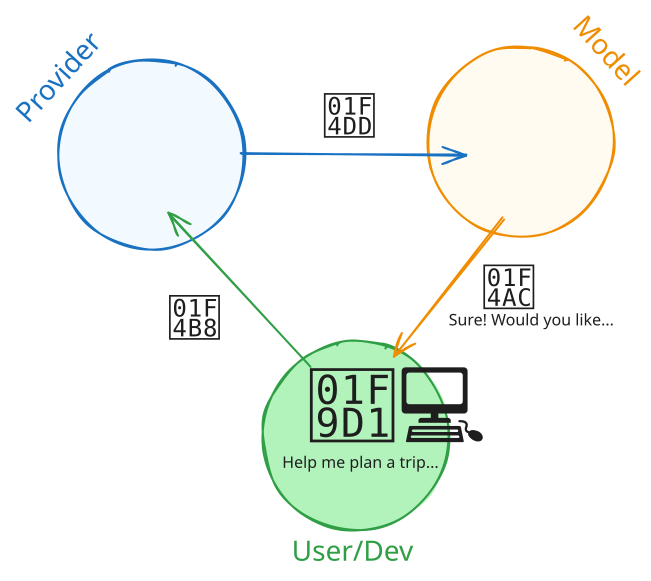
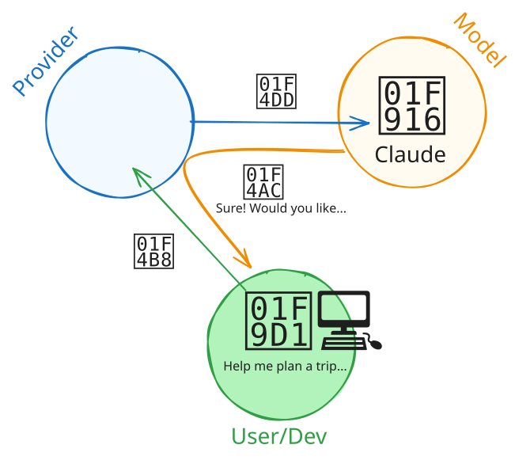
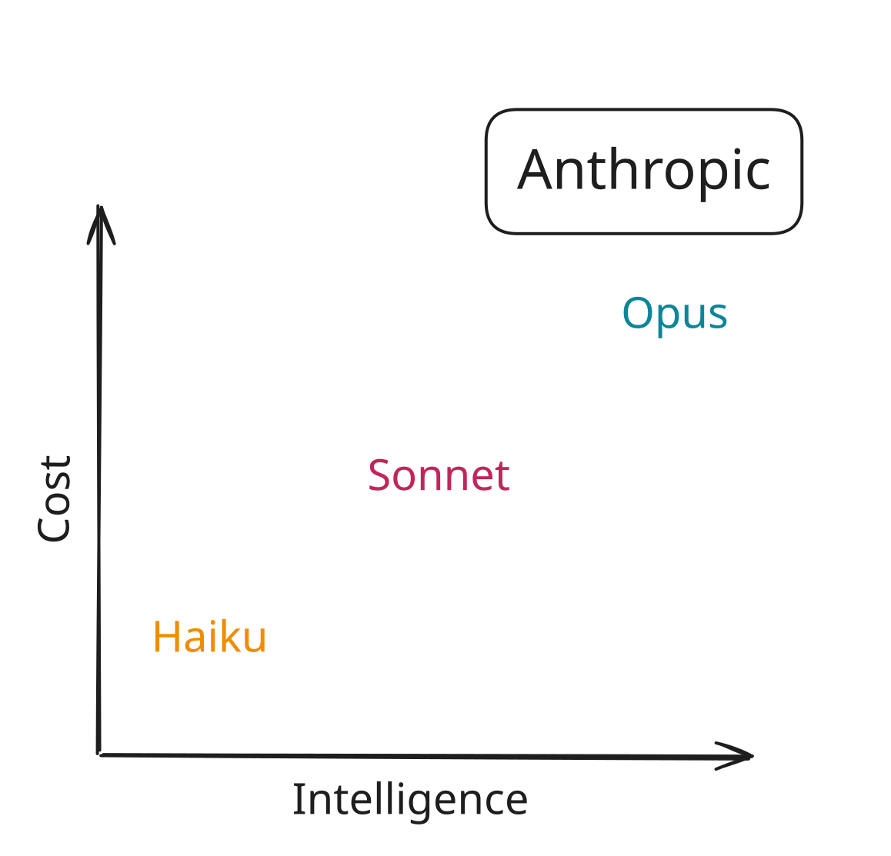
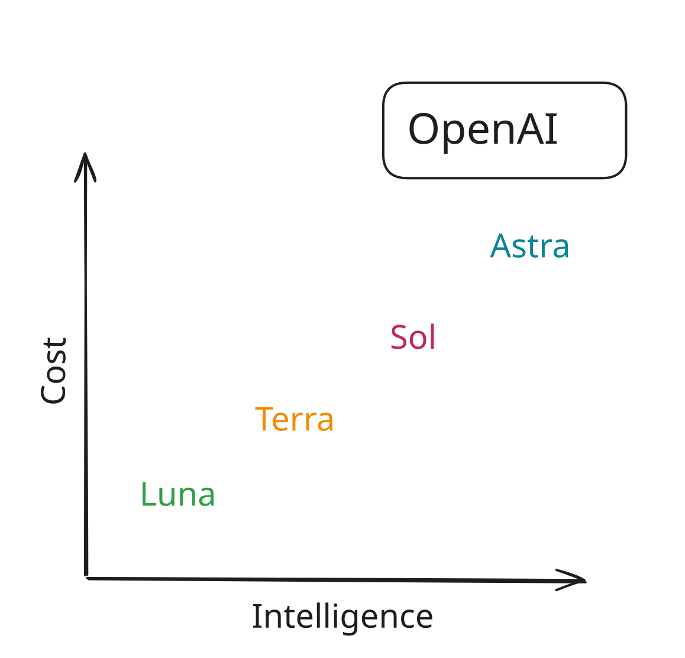

# [Providers and Models]{.white .ph4 style="background-color: #4ea8a7e6;"} {.no-invert-dark-mode background-image="assets/sunira-moses-Naj9-n5apvs-unsplash.jpg" background-size="cover" background-position="center"}

## {.center}

::: {.r-fit-text .incremental}
**Provider**
:    company that hosts and serves models

**Model**
:    a specific LLM with particular capabilities
:::

```{=html}
<style>
dt {
  line-height: 0.8;
}

dd {
  margin-bottom: 1em;
  margin-left: 0 !important;
}

dd:before {
  content: "\2192";
  font-family: var(--r-code-font);
  font-size: 0.8em;
  opacity: 0.66;
}
</style>
```

## {.text-center transition="fade"}


## {.text-center transition="fade"}



## {.text-center transition="fade"}


## {.text-center transition="fade"}



## {.text-center transition="fade"}


## {.text-center transition="fade"}


## {.text-center transition="fade"}



## {.text-center transition="fade"}


::: notes
Posit AI Pass is the provider we will use today. It hosts models from several
companies, including Anthropic's Claude models.
:::

## How are models different?

::: incremental
1. **Context:** How many tokens can you give the model?
1. **Speed:** How many tokens per second?
1. **Cost:** How much does it cost to use the model?
1. **Intelligence:** How smart is the model?
1. **Capabilities:** Does it support images, reasoning, tools, or structured output?
:::

::: notes
1. Context: 1M tokens is common among the newest models here. Smaller models can still have shorter windows like 200k for Claude Haiku 4.5.
1. Speed: In the table, output speed ranges from about 38 tokens/sec (Claude Opus 4.6) to 85 (Gemma 4 26B). These are Artificial Analysis measurements.
1. Cost: Relative Posit AI Pass costs range from 0.1x for Gemma 4 26B to 1.67x for the Claude Opus models. Output tokens usually cost more than input tokens.
:::

## {transition="fade"}

{style="display: block; margin: auto;"}

::: notes
Anthropic builds a family of models called Claude. Within that family, model
tiers trade speed/cost for intelligence.
:::

## {transition="fade"}

{style="display: block; margin: auto;"}

::: notes
* Haiku is small, fast, and cheap
* Sonnet balances speed and intelligence
* Opus is the largest and most intelligent

The positions are conceptual, not benchmark results. Version numbers identify
newer generations within each tier.
:::

## {transition="fade"}

{style="display: block; margin: auto;"}

::: notes
OpenAI follows a similar pattern. Models with "mini" or "nano" in the name are
usually faster and cheaper than the full-size model.
:::

## Open-weight and local models

::: {.incremental}
* **Open-weight** means the trained weights are available to download under a license.
* Run them locally, self-host them, or use a service like Hugging Face.
* Posit AI Pass also serves selected open-weight models.
* Some models are small enough to run on your laptop. Larger models require more memory or specialized hardware.
* Ollama and LM Studio are common tools for running models locally.
:::

::: notes
Open-weight does not necessarily mean open-source or unrestricted. The model's
license determines how you can use, modify, and redistribute it.

A model running on your computer is local. A model running on infrastructure
managed by your organization is self-hosted.

Open-weight models aren't necessarily local.
:::


## Posit AI Pass models {.smaller}

::: {.fragment}
Posit AI Pass gives you access to models from various providers.
:::

::: {.fragment}

:::

## Artificial Analysis 

{alt="Screenshot of the Artificial Analysis website home page, showing independent rankings of AI models by intelligence, speed, and cost per task."}

[artificialanalysis.ai](https://artificialanalysis.ai/leaderboards/models)

::: notes
Ranking of models.
:::

## Start capable, then test smaller

::: incremental
1. Start with a recent model that supports the capabilities you need.
1. Try a faster or cheaper model.
1. Keep the smaller model if it performs well on your task.
:::

## {#ellmer .center .smaller transition="fade"}

:::::: {style="display: flex; flex-direction: row; align-items: center; gap: 1em;"}
::::: {.column style="flex: 0 0 auto;"}
{width="170px"}
:::::

::::: {.column}
:::: fragment
**Providers**

::: incremental
* `chat_posit()`
* `chat_openai()`
* `chat_anthropic()`
* `chat_google_gemini()`
:::
::::

:::: fragment
**Open-weight and local models**

* `chat_ollama()`
* `chat_huggingface()`
::::

:::: fragment
**Enterprise**

* `chat_aws_bedrock()`
::::

:::: fragment
and more!
::::
:::::
::::::

::: footer
<https://ellmer.tidyverse.org/>
:::

## {#chatlas .center .smaller transition="fade"}

::::: {style="display: flex; flex-direction: row; align-items: center; gap: 1em;"}
:::: {.column style="flex: 0 0 auto;"}
::: {style="text-align: center; width: 260px;"}
**chatlas**

{width="190px"}
:::
::::

:::: {.column}
**Providers**

* `ChatPosit()`
* `ChatOpenAI()`
* `ChatAnthropic()`
* `ChatGoogle()`

**Open-weight and local models**

* `ChatOllama()`
* `ChatHuggingFace()`

**Enterprise**

* `ChatBedrockAnthropic()`

and more!
::::
:::::

::: footer
<https://posit-dev.github.io/chatlas/get-started/models.html>
:::

::: notes
The constructor determines which provider receives the request. Direct access
to Anthropic, OpenAI, or Google requires credentials for that provider.

Posit AI Pass is also a provider. It hosts models created by several companies.
For example, `ChatPosit(model="moonshotai/Kimi-K3")` sends the request through
Posit AI Pass, not directly to Moonshot AI.
:::

## Switch models with `model=`

::: {.easy-columns .smaller style="--code-font-size: 0.56em"}
::: col
[{height="36px" alt="R"} ellmer]{.flex .items-center .gap-1}

```r
chat <- chat_anthropic(
  model = "claude-sonnet-5"
)
```

::: fragment
```r
chat <- chat_anthropic(
  model = "claude-opus-4-8"
)
```
:::
:::

::: col
[{height="36px" alt="Python"} chatlas]{.flex .items-center .gap-1}

```python
chat = chatlas.ChatAnthropic(
    model="claude-sonnet-5"
)
```

::: fragment
```python
chat = chatlas.ChatAnthropic(
    model="claude-opus-4-8"
)
```
:::
:::
:::

::: notes
Both calls use Anthropic as the provider. Only the model changes. Direct
Anthropic access requires Anthropic credentials.
:::

## Shortcut: `chat()` and `ChatAuto()` {transition="fade"}

::: {.easy-columns .smaller style="--code-font-size: 0.56em"}
::: col
[{height="36px" alt="R"} ellmer]{.flex .items-center .gap-1}

```{.r code-line-numbers="3"}
library(ellmer)

chat <- chat("posit")
```
:::

::: col
[{height="36px" alt="Python"} chatlas]{.flex .items-center .gap-1}

```{.python code-line-numbers="3-5"}
import chatlas

chat = chatlas.ChatAuto(
    "posit"
)
```
:::
:::

::: notes
`chat()` and `ChatAuto()` provide a common interface across providers. Give
them a provider name to use that provider's default model. Posit AI Pass
currently selects Claude Sonnet 5 by default.
:::

## Shortcut: `chat()` and `ChatAuto()` {transition="fade"}

::: {.easy-columns .smaller style="--code-font-size: 0.56em"}
::: col
[{height="36px" alt="R"} ellmer]{.flex .items-center .gap-1}

```{.r code-line-numbers="3-5"}
library(ellmer)

chat <- chat(
  "posit/moonshotai/Kimi-K3"
)
```
:::

::: col
[{height="36px" alt="Python"} chatlas]{.flex .items-center .gap-1}

```{.python code-line-numbers="3-5"}
import chatlas

chat = chatlas.ChatAuto(
    "posit/moonshotai/Kimi-K3"
)
```
:::
:::

::: notes
Use `"provider/model"` to select both at once. This example still uses
Posit AI Pass as the provider and selects Kimi K3 as the model.
:::

## List models available through Posit AI Pass

::: {.easy-columns .smaller style="--code-font-size: 0.66em"}
::: col
[{height="36px" alt="R"} ellmer]{.flex .items-center .gap-1}

```r
library(ellmer)

models_posit()
```
:::

::: col
[{height="36px" alt="Python"} chatlas]{.flex .items-center .gap-1}

```python
import chatlas

chatlas.ChatPosit().list_models()
```
:::
:::

# Your Turn `07_models` {.slide-your-turn}



1. List the models available through Posit AI Pass.
1. Send the same prompt to two models.
1. Compare the responses.


# [Multi-modal input]{.hidden} {background-image="assets/bud-helisson-kqguzgvYrtM-unsplash.jpg" background-size="cover" background-position="center"}

[Multi-modal input]{.white .b .absolute top="-400px" right=0 style="font-size: 3em;"}

## A picture is worth a thousand words {.center}

::: fragment
Or for an LLM, a picture is roughly 227 words, or [170 tokens]{.b .blue}.
:::

::: fragment
🖼️ 🔍 [Open Images Dataset](https://storage.googleapis.com/openimages/web/visualizer/index.html?type=localized%20narratives&set=train&c=/m/06_fw&id=025d772e7181ca1f){preview-link=true}
:::

## 🌆 content_image_file {transition="fade"}

::: {style="--code-font-size: 0.66em"}
[{height="36px" alt="R"} ellmer]{.flex .items-center .gap-1}

```{.r code-line-numbers="4-7"}
library(ellmer)

chat <- chat("openai/gpt-4.1-nano")
chat$chat(
  content_image_file("cute-cats.jpg"),
  "What do you see in this image?"
)
```


[{height="36px" alt="Python"} chatlas]{.flex .items-center .gap-1}

```{.python code-line-numbers="4-7"}
import chatlas

chat = chatlas.ChatAuto("openai/gpt-4.1-nano")
chat.chat(
    chatlas.content_image_file("cute-cats.jpg"),
    "What do you see in this image?"
)
```
:::

## [🐈](https://placecats.com/bella/400/400){target="_blank" rel="noopener noreferrer"} content_image_url {transition="fade"}

::: {style="--code-font-size: 0.66em"}
[{height="36px" alt="R"} ellmer]{.flex .items-center .gap-1}

```{.r code-line-numbers="5"}
library(ellmer)

chat <- chat("openai/gpt-4.1-nano")
chat$chat(
  content_image_url("https://placecats.com/bella/400/400"),
  "What do you see in this image?"
)
```


[{height="36px" alt="Python"} chatlas]{.flex .items-center .gap-1}

```{.python code-line-numbers="5"}
import chatlas

chat = chatlas.ChatAuto("openai/gpt-4.1-nano")
chat.chat(
    chatlas.content_image_url("https://placecats.com/bella/400/400"),
    "What do you see in this image?"
)
```
:::

## Your Turn `08_vision` {.slide-your-turn}

1. I've put some images of food in the `data/recipes/images` folder.

2. Your job: show the food to the LLM and see if it gets hungry.



## 📑 content_pdf_file

::: {style="--code-font-size: 0.66em"}
[{height="36px" alt="R"} ellmer]{.flex .items-center .gap-1}

```{.r code-line-numbers="5"}
library(ellmer)

chat <- chat("openai/gpt-4.1-nano")
chat$chat(
  content_pdf_file("financial-report.pdf"),
  "What's my tax liability for 2024?"
)
```


[{height="36px" alt="Python"} chatlas]{.flex .items-center .gap-1}

```{.python code-line-numbers="5"}
import chatlas

chat = chatlas.ChatAuto("openai/gpt-4.1-nano")
chat.chat(
    content_pdf_file("financial-report.pdf"),
    "What's my tax liability for 2024?"
)
```
:::

## 📑 content_pdf_url

::: {style="--code-font-size: 0.66em"}
[{height="36px" alt="R"} ellmer]{.flex .items-center .gap-1}

```{.r code-line-numbers="5"}
library(ellmer)

chat <- chat("openai/gpt-4.1-nano")
chat$chat(
  content_pdf_url("http://pdf.secdatabase.com/1757/0001104659-25-042659.pdf"),
  "Describe Tesla’s executive compensation and stock award programs."
)
```


[{height="36px" alt="Python"} chatlas]{.flex .items-center .gap-1}

```{.python code-line-numbers="5"}
import chatlas

chat = chatlas.ChatAuto("openai/gpt-4.1-nano")
chat.chat(
    content_pdf_url("http://pdf.secdatabase.com/1757/0001104659-25-042659.pdf"),
    "Describe Tesla’s executive compensation and stock award programs."
)
```
:::

## Your Turn `09_pdf` {.slide-your-turn}

1. We have the actual recipes as PDFs in the `data/recipes/pdf` folder.

2. Your job: ask the LLM to convert the recipes to markdown.



# Structured output {background-image="assets/vitaly-taranov-J6hE2DTWSEw-unsplash.jpg" background-size="cover" background-position="center top"}

## How would you extract name and age? {style="--code-font-size: 0.66em"}

```{r}
#| echo: true

age_free_text <- list(
  "I go by Alex. 42 years on this planet and counting.",
  "Pleased to meet you! I'm Jamal, age 27.",
  "They call me Li Wei. Nineteen years young.",
  "Fatima here. Just celebrated my 35th birthday last week.",
  "The name's Robert - 51 years old and proud of it.",
  "Kwame here - just hit the big 5-0 this year."
)
```

## If you wrote R code, it might look like this... {.scrollable style="--code-font-size: 0.66em"}

```{r}
#| echo: true

word_to_num <- function(x) {
  # normalize
  x <- tolower(x)
  # direct numbers
  if (grepl("\\b\\d+\\b", x)) {
    return(as.integer(regmatches(x, regexpr("\\b\\d+\\b", x))))
  }
  # hyphenated like "5-0"
  if (grepl("\\b\\d+\\s*-\\s*\\d+\\b", x)) {
    parts <- as.integer(unlist(strsplit(
      regmatches(x, regexpr("\\b\\d+\\s*-\\s*\\d+\\b", x)),
      "\\s*-\\s*"
    )))
    return(10 * parts[1] + parts[2])
  }
  # simple word numbers
  ones <- c(
    zero = 0,
    one = 1,
    two = 2,
    three = 3,
    four = 4,
    five = 5,
    six = 6,
    seven = 7,
    eight = 8,
    nine = 9,
    ten = 10,
    eleven = 11,
    twelve = 12,
    thirteen = 13,
    fourteen = 14,
    fifteen = 15,
    sixteen = 16,
    seventeen = 17,
    eighteen = 18,
    nineteen = 19
  )
  tens <- c(
    twenty = 20,
    thirty = 30,
    forty = 40,
    fifty = 50,
    sixty = 60,
    seventy = 70,
    eighty = 80,
    ninety = 90
  )
  # e.g., "nineteen"
  if (x %in% names(ones)) {
    return(ones[[x]])
  }
  # e.g., "thirty five" or "thirty-five"
  x2 <- gsub("-", " ", x)
  parts <- strsplit(x2, "\\s+")[[1]]
  if (
    length(parts) == 2 && parts[1] %in% names(tens) && parts[2] %in% names(ones)
  ) {
    return(tens[[parts[1]]] + ones[[parts[2]]])
  }
  if (length(parts) == 1 && parts[1] %in% names(tens)) {
    return(tens[[parts[1]]])
  }
  return(NA_integer_)
}

# Extract name candidates
extract_name <- function(s) {
  # patterns that introduce a name
  pats <- c(
    "I go by\\s+([A-Z][a-z]+)",
    "I'm\\s+([A-Z][a-z]+(?:\\s+[A-Z][a-z]+)?)",
    "They call me\\s+([A-Z][a-z]+(?:\\s+[A-Z][a-z]+)?)",
    "^([A-Z][a-z]+) here",
    "The name's\\s+([A-Z][a-z]+)",
    "^([A-Z][a-z]+)\\s" # fallback: leading capital word
  )
  for (p in pats) {
    m <- regexpr(p, s, perl = TRUE)
    if (m[1] != -1) {
      return(sub(p, "\\1", regmatches(s, m)))
    }
  }
  NA_character_
}

# Extract age phrases and convert to number
extract_age <- function(s) {
  # capture common age phrases around a number
  m <- regexpr(
    "(\\b\\d+\\b|\\b\\d+\\s*-\\s*\\d+\\b|\\b[Nn][a-z-]+\\b)\\s*(years|year|birthday|young|this)",
    s,
    perl = TRUE
  )
  if (m[1] != -1) {
    token <- sub(
      "(years|year|birthday|young|this)$",
      "",
      trimws(substring(s, m, m + attr(m, "match.length") - 1))
    )
    return(word_to_num(token))
  }
  # handle pure word-number without trailing keyword (e.g., "Nineteen years young." handled above)
  m2 <- regexpr("\\b([A-Z][a-z]+)\\b\\s+years", s, perl = TRUE)
  if (m2[1] != -1) {
    token <- tolower(sub("\\s+years.*", "", regmatches(s, m2)))
    return(word_to_num(token))
  }
  # handle hyphenated "big 5-0"
  m3 <- regexpr("big\\s+(\\d+\\s*-\\s*\\d+)", s, perl = TRUE)
  if (m3[1] != -1) {
    token <- sub("big\\s+", "", regmatches(s, m3))
    return(word_to_num(token))
  }
  NA_integer_
}
```

## If you wrote R code, it might look like this... {.scrollable}

::: {.easy-columns .gap-2}
```{r}
#| echo: true

dplyr::tibble(
  name = purrr::map_chr(age_free_text, extract_name),
  age = purrr::map_int(age_free_text, extract_age)
)
```

```{r}
#| echo: true

age_free_text
```
:::

::: footer
😬 not great, `gpt-5`.
:::

## But if you ask an LLM... {transition="fade"}

```{.r code-line-numbers="4-5|8,11"}
library(ellmer)

chat <- chat(
  "openai/gpt-5-nano",
  system_prompt = "Extract the name and age."
)

chat$chat(age_free_text[[1]])
#>

chat$chat(age_free_text[[2]])
#>
```

## But if you ask an LLM... {transition="fade"}

```{.r code-line-numbers="8-12"}
library(ellmer)

chat <- chat(
  "openai/gpt-5-nano",
  system_prompt = "Extract the name and age."
)

chat$chat(age_free_text[[1]])
#> Name: Alex; Age: 42

chat$chat(age_free_text[[2]])
#> Name: Jamal; Age: 27
```

## Wouldn't this be nice? {transition="fade"}

```{.r}
chat$chat(age_free_text[[1]])
#> list(
#>   name = "Alex",
#>   age = 42
#> )
```

## Structured chat output {transition="fade"}

```{.r code-line-numbers="1"}
chat$chat_structured(age_free_text[[1]])
#> list(
#>   name = "Alex",
#>   age = 42
#> )
```

## Structured chat output {transition="fade"}

```{.r code-line-numbers="1-4|6"}
type_person <- type_object(
  name = type_string(),
  age = type_integer()
)

chat$chat_structured(age_free_text[[1]], type = type_person)
#> list(
#>   name = "Alex",
#>   age = 42
#> )
```

## Structured chat output {transition="fade"}

```{.r code-line-numbers="7-11"}
type_person <- type_object(
  name = type_string(),
  age = type_integer()
)

chat$chat_structured(age_free_text[[1]], type = type_person)
#> $name
#> [1] "Alex"
#>
#> $age
#> [1] 42
```

## ellmer's type functions


::: fragment
```{.r}
type_person <- type_object(
  name = type_string("The person's name"),
  age = type_integer("The person's age in years")
)
```
:::

## In Python, use Pydantic {transition="fade"}

```{.python code-line-numbers="2|4-6|9-12|13"}
import chatlas
from pydantic import BaseModel

class Person(BaseModel):
    name: str
    age: int

chat = chatlas.ChatAuto("openai/gpt-5-nano")
chat.chat_structured(
    "I go by Alex. 42 years on this planet and counting.",
    data_model=Person
)
#> Person(name='Alex', age=42)
```

::: footer
[chatlas: Structured Data](https://posit-dev.github.io/chatlas/get-started/structured-data.html)
:::

## In Python, use Pydantic {transition="fade"}

```{.python code-line-numbers="2,4-6"}
import chatlas
from pydantic import BaseModel, Field

class Person(BaseModel):
    name: str = Field(..., description="The person's name")
    age: int = Field(..., description="The person's age in years")

chat = chatlas.ChatAuto("openai/gpt-5-nano")
chat.chat_structured(
    "I go by Alex. 42 years on this planet and counting.",
    data_model=Person
)
#> Person(name='Alex', age=42)
```

## In Python, use Pydantic {transition="fade"}

```{.python code-line-numbers="2|4-10"}
import chatlas
from pydantic import BaseModel, ConfigDict

class Person(BaseModel):
    model_config = ConfigDict(use_attribute_docstrings=True)

    name: str
    """The person's name"""
    age: int
    """The person's age in years"""
```

::: footer
[pydantic: use_attribute_docstrings](https://docs.pydantic.dev/latest/api/config/#pydantic.config.ConfigDict.use_attribute_docstrings)
:::

# Your Turn `10_structured-output` {.slide-your-turn}

1. We also have text versions of the recipes in `data/recipes/txt`.

1. Use `ellmer::type_*()` or a Pydantic model to extract structured data from the recipe you used in **activity 09**.

1. I've given you the expected structure, you just need to implement it.



# Parallel and batch calls {background-image="assets/barna-bartis-1DLPzq1kL3M-unsplash.jpg" background-size="cover" background-position="center"}

## Structured chat output {transition="fade"}

```{.r code-line-numbers="6-11"}
type_person <- type_object(
  name = type_string(),
  age = type_integer()
)

chat$chat_structured(age_free_text[[1]], type = type_person)
#> $name
#> [1] "Alex"
#>
#> $age
#> [1] 42
```

## Structured chat output {transition="fade"}

```{.r code-line-numbers="6-7"}
type_person <- type_object(
  name = type_string(),
  age = type_integer()
)

chat$chat_structured(age_free_text, type = type_person)
#> ???
```

## Structured chat output {transition="fade"}

```{.r code-line-numbers="6-11"}
type_person <- type_object(
  name = type_string(),
  age = type_integer()
)

chat$chat_structured(age_free_text, type = type_person)
#> Error in `FUN()`:
#> ! `...` must be made up strings or <content> objects, not a list.
```

## Parallel chat calls {transition="fade"}

```{.r}
parallel_chat_structured(
  chat,
  age_free_text,
  type = type_person
)
```

## Parallel chat calls {transition="fade"}

```{.r}
parallel_chat_structured(
  chat,
  age_free_text,
  type = type_person
)
#> [working] (0 + 0) -> 2 -> 4 | ■■■■■■■■■■■■■■■■■■■■■             67%
```

## Parallel chat calls {transition="fade"}

```{.r}
parallel_chat_structured(
  chat,
  age_free_text,
  type = type_person
)
#>     name age
#> 1   Alex  42
#> 2  Jamal  27
#> 3 Li Wei  19
#> 4 Fatima  35
#> 5 Robert  51
#> 6  Kwame  50
```

## Batch chat calls {transition="fade"}

```{.r code-line-numbers="1"}
batch_chat_structured(
  chat,
  age_free_text,
  type = type_person
)
```

## Batch chat calls {transition="fade"}

```{.r code-line-numbers="5"}
batch_chat_structured(
  chat,
  age_free_text,
  type = type_person,
  path = "people.json"
)
```

## Batch chat calls {transition="fade"}

```{.r code-line-numbers="1"}
chat <- chat("anthropic/claude-3-5-haiku-20241022")
batch_chat_structured(
  chat,
  age_free_text,
  type = type_person,
  path = "people.json"
)
```

## Batch vs. parallel

::: easy-columns
::: col
### Parallel

* 🌲 Works for any provider/model<br>&nbsp;

* ⚡ Much faster for small jobs

* 💸 More expensive

* 😓 Not easy to stop/resume

* [🔜 Coming soon to chatlas]{.fragment fragment-index=1}
:::

::: col
### Batch

* 🌱 Only works for some providers (OpenAI, Anthropic)

* ⏲️ Finishes... eventually

* 🏦 Much cheaper per prompt

* 😎 Easy to stop/resume

* [🧑‍🚀 Works in chatlas]{.fragment fragment-index=1}
:::
:::

## chatlas.batch_chat_structured {transition="fade"}

```{.python}
from chatlas import ChatAuto, batch_chat_structured

chat = chatlas.ChatAuto("anthropic/claude-3-haiku-20240307")
res = batch_chat_structured(
    chat=chat,
    prompts=age_free_text,
    data_model=Person,
    path="people.json",
)
```

# Your Turn `11_batch` {.slide-your-turn}

1. Take your `type_recipe` or `Recipe` model from **activity 10**...

2. And apply it to _all the text recipes_ in `data/recipes/txt`.

3. Use parallel processing with `gpt-4.1-nano` from OpenAI.

4. Use the Batch API with Claude 3.5 Haiku from Anthropic.

5. Save the results to `data/recipes/recipes.json` and try out the Shiny recipe cookbook app!


