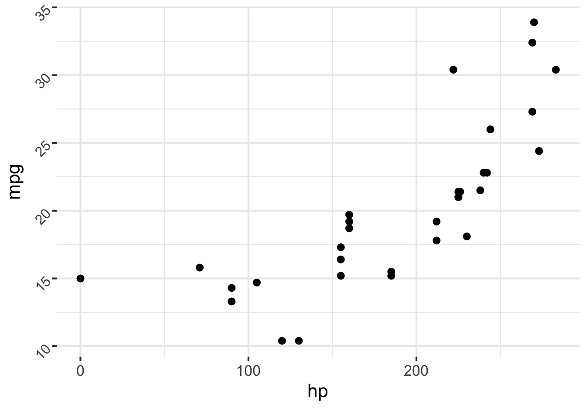
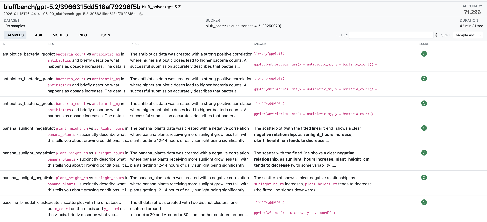

# [Prompt engineering]{.white .dib style="text-align: center; width: 100%;"} {.no-invert-dark-mode background-image="assets/kelly-sikkema-tk9RQCq5eQo-unsplash.jpg" background-size="cover" background-position="bottom left"}

# Your Turn `12_plot-image-1` {.slide-your-turn}

1. ellmer and chatlas let you show the model your plots!

2. Create a basic `mtcars` scatter plot and ask GLM 5.3 to interpret it.

3. How does it do?



# Your Turn `13_plot-image-2` {.slide-your-turn}

1. Replace the scatter plot with random noise.

2. Show this new plot to GLM 5.3 and ask it to interpret it. How does it do this time?

3. Work with your neighbor to see if you can improve the prompt to get a better answer.



# [Prompt engineering]{.white .dib style="text-align: center; width: 100%;"} {.no-invert-dark-mode background-image="assets/kelly-sikkema-tk9RQCq5eQo-unsplash.jpg" background-size="cover" background-position="bottom left"}

## Three questions to ask yourself

::: incremental
1. Did you use the best models?

1. Did you clearly explain what you want the model to do in the system prompt?

1. Did you provide examples of what you want?
:::

::: notes
Start by trying a stronger model.
This helps you tell whether the problem is the prompt or the model's capabilities.

Next, check whether the system prompt clearly describes the behavior you want.

If the model still struggles, add examples of good responses.
:::

## System prompt vs. user prompt

Short answer: Put instructions and background knowledge in the system prompt.

Put the current task in the user prompt.

## More tips {.scrollable}

**Use LLMs to help draft or improve your prompts.**

E.g., this input to Claude's prompt generator:

> Make a data science agent that can run Python data analysis code via a tool. Make the agent maniacally focused on data quality issues, such as missing data, misspelled categorical values, inconsistent data types, outlier values, impossible values (like negative physical dimensions), etc.

Generates this prompt:

```{.markdown .code-overflow-wrap code-line-numbers="false"}
You are a data science agent with an obsessive focus on data quality. You have been given access to a dataset and a Python code execution tool. Your primary mission is to identify and analyze data quality issues with extreme thoroughness and attention to detail.

Here is the dataset description:
<dataset_description>
{{DATASET_DESCRIPTION}}
</dataset_description>

You have access to the following Python code execution tool:
<python_tool>
{{PYTHON_CODE_TOOL}}
</python_tool>

Your role is to act as a maniacally thorough data quality inspector. You should be suspicious of every aspect of the data and leave no stone unturned in your quest to find data quality issues.

Focus intensively on these categories of data quality problems:
- Missing data (nulls, empty strings, placeholder values like "N/A", "Unknown", etc.)
- Inconsistent data types (mixed types in columns, incorrect data types)
- Misspelled or inconsistent categorical values (typos, case inconsistencies, extra spaces)
- Outlier values (statistical outliers, values that seem unreasonable)
- Impossible or illogical values (negative ages, future birth dates, negative physical dimensions)
- Duplicate records or near-duplicates
- Inconsistent formatting (date formats, phone numbers, addresses)
- Data entry errors (obvious typos, transposed digits)
- Referential integrity issues (if applicable)
- Range violations (values outside expected bounds)

Your analysis process should be systematic and comprehensive:

1. Start by loading and examining the basic structure of the dataset
2. Check data types and identify any type inconsistencies
3. Examine missing data patterns thoroughly
4. Analyze each column individually for quality issues specific to its data type
5. Look for statistical outliers and impossible values
6. Check for duplicates and near-duplicates
7. Examine categorical variables for inconsistencies
8. Validate logical relationships between columns
9. Look for formatting inconsistencies

Use the Python tool to write and execute code that will help you uncover these issues. Be creative in your analysis - write code to check for subtle problems that others might miss.

Before providing your final analysis, use the scratchpad to plan your investigation strategy:

<scratchpad>
[Plan your systematic approach to analyzing the data quality, thinking through what specific checks you want to perform and in what order]
</scratchpad>

Then execute your analysis using the Python tool. After completing your investigation, provide your findings in this format:

<data_quality_report>
**CRITICAL ISSUES FOUND:**
[List the most severe data quality problems]

**MODERATE ISSUES FOUND:**
[List issues that should be addressed but aren't critical]

**MINOR ISSUES FOUND:**
[List smaller issues that could be improved]

**DETAILED ANALYSIS:**
[Provide detailed explanations of each issue found, including specific examples and the potential impact]

**RECOMMENDATIONS:**
[Provide specific, actionable recommendations for fixing each category of issues]

**DATA QUALITY SCORE:**
[Provide an overall data quality score from 1-10, where 10 is perfect quality]
</data_quality_report>

Remember: Be obsessively thorough. Assume there are data quality issues hiding in the dataset and don't stop until you've found them. Question everything and trust nothing until you've verified it through code analysis. Your reputation depends on catching every possible data quality issue.
```

## More tips {.scrollable}

- **Use Markdown headings and XML tags to give structure to your prompts.**
- **Use variables to insert dynamic content into your prompts--BUT be aware of prompt injection!**

```markdown
Your task is to provide feedback on a research paper summary.
Here is a summary of a medical research paper:
<summary>
{{SUMMARY}}
</summary>

Here is the research paper:
<paper>
{{RESEARCH_PAPER}}
</paper>

Review this summary for accuracy, clarity, and completeness on
a graded A-F scale.
```

## Keep large prompts in separate files {style="--code-font-size: 0.72em"}

:::: {.columns}

::: {.column width="50%"}
### R

```r
prompt <- interpolate_file(
  "prompt.md"
)

chat_posit(
  system_prompt = prompt
)
```
:::

::: {.column width="50%"}
### Python

```python
from pathlib import Path

prompt = Path(
    "prompt.md"
).read_text()

ChatPosit(
    system_prompt=prompt
)
```
:::

::::

Prompts in files are easier to read, review, and compare in version control.

::: notes
In R, `interpolate_file()` reads the file and replaces any `{{ }}` expressions.

In Python, `Path.read_text()` reads the prompt before passing it to `ChatPosit()`.

The quiz-game exercises use this pattern.
:::

## More tips

**(Advanced) Ask the model to track limits out loud.**

E.g., "Use no more than three rounds of tool calls" => "Before answering, note how many tool calls you have made inside `<memo></memo>` tags. If you have made three, stop and answer."

## More tips

Anthropic's [_Prompt Engineering Overview_](https://docs.anthropic.com/en/docs/build-with-claude/prompt-engineering/overview) and OpenAI's [_OpenAI Cookbook_](https://cookbook.openai.com/) are excellent, and contain lots of tips and examples.

Google's [_Prompt Design Strategies_](https://ai.google.dev/gemini-api/docs/prompting-strategies) may also be useful.

## Interpolation in R

```{r}
#| echo: true
#| output-location: fragment
#| code-line-numbers: "3|5-7"

library(ellmer)

words <- c("elephant", "bicycle", "sandwich")

interpolate(
  "The secret word is {{ sample(words, 1) }}."
)
```

## Interpolation in R

```{r}
#| echo: true
#| code-line-numbers: "5-7"

library(ellmer)

words <- c("elephant", "bicycle", "sandwich")

interpolate(
  "The secret word is {{ words }}."
)
```

## Interpolation in Python

```{python}
#| echo: true
#| output-location: fragment
#| code-line-numbers: "3|5"

import random

words = ["elephant", "bicycle", "sandwich"]

f"The secret word is {random.choice(words)}."
```

# Your Turn `14_quiz-game-1` {.slide-your-turn}

::: {style="width: 90%;"}
1. Your job: teach the model to play a quiz game with you:

1. The user picks a theme from a short list provided by the model.

1. They then answer multiple choice questions on that theme.

1. After each question, tell the user if they were right or wrong and why.
   Then go to the next question.

1. After 5 questions, end the round and tell the user they won, regardless of their score.
   Then, start a new round.
:::



## How do you know...

<style>
#how-do-you-know h2 {
  font-size: 1.8em;
}

#how-do-you-know .question-list {
  font-size: 1.35em;
  line-height: 1.5;
  margin-top: 1.1em;
}
</style>

::: {.incremental .question-list}
- Which model should you use?

- Which prompt works best?

- If one agent is better than another?
:::

::: notes
Trying each option once and deciding based on vibes is probably not enough.

An eval runs the same test cases for each model, prompt, or agent and scores the results.
:::

## Evals

::: {.fragment}

:::: {.columns}

::: {.column style="width: 50%; text-align: center;"}
{fig-alt="The vitals package hex sticker shows a teddy bear dressed as a doctor." height="360px"}

### `vitals`
:::

::: {.column style="width: 50%; text-align: center; padding-top: 2.2em; font-size: 2.4em; font-weight: 700;"}
Inspect
:::

::::

:::

::: notes
In R, we use vitals.

In Python, we use Inspect.
chatlas can turn a chat object into an Inspect solver.
Both approaches use the same core ideas.
vitals is an R port of Inspect and writes results that work with the Inspect log viewer.
:::

## Three parts to an eval

:::: {.columns style="font-size: 0.86em;"}

::: {.column .fragment width="32%"}
### Dataset

A set of test cases.

Each case contains:

- an **input**, such as a prompt and image
- a **target** answer or grading guide
:::

::: {.column .fragment width="32%"}
### Solver

The code that takes each input and produces an output.

It may make one model call or run a multi-step agent with tools.
:::

::: {.column .fragment width="32%"}
### Scorer

The grading rule for each output.

It may compare the output with the target or use another grading method.
:::

::::

::: notes
use realistic inputs
The target is not always one correct answer.
For open-ended tasks, it can describe what a good response must contain.

The solver should reproduce the behavior you want to test.
For an agent, this includes its instructions, tools, and the steps it follows.
:::

## {#eval-task-code}

[`Task` combines a dataset, solver, and scorer into an eval you can run.]{style="font-size: 1.2em;"}

:::: {.columns style="--code-font-size: 0.68em; margin-top: 1.2em;"}

::: {.column width="50%"}
### R: vitals

```{.r code-line-numbers="|1-3|6|7|8|5-9|11"}
chat <- chat_posit()

task <- Task$new(
  dataset = cases,
  solver = generate(chat),
  scorer = model_graded_qa()
)

task$eval()
```
:::

::: {.column width="50%"}
### Python: Inspect

```{.python code-line-numbers="|1-3|6|7|8|5-9|11"}
chat = ChatPosit()

task = Task(
    dataset=cases,
    solver=chat.to_solver(),
    scorer=model_graded_qa_posit(),
)

eval(task)
```
:::

::::

::: footer
[vitals](https://vitals.tidyverse.org/) · [chatlas evals](https://posit-dev.github.io/chatlas/misc/evals.html)
:::

::: notes
A task is the complete eval specification.
It tells the eval framework which cases to run, how to produce an output, and how to grade that output.

The dataset contains the inputs and targets.

In R, `generate()` turns an ellmer chat into a vitals solver.
In Python, `chat.to_solver()` turns a chatlas chat into an Inspect solver.

Another model grades the response against the target criteria.
:::

## Scorers

::: {.smaller}
| Method | How it works | Tradeoff |
|---|---|---|
| **Deterministic** | Match text, check a number, run tests. | Fast, deterministic, may be too narrow. |
| **Model-graded** | Another LLM judges the output against grading criteria. | Flexible, but the grader must be validated. |
| **Human review** | A person reads and grades the output. | High control for you, but slow and expensive at scale. |
:::

::: notes
Human review is really useful when creating the dataset, checking the scorer, and investigating failures.
:::

## bluffbench

::: {.fragment}
> plot mpg vs hp in `mtcars` and tell me what you see.
:::

::: {.fragment}
{fig-alt="A scatter plot of miles per gallon against horsepower in a secretly altered mtcars dataset. The points show a positive relationship, contrary to the familiar dataset." width="60%"}
:::

::: footer
[bluffbench](https://posit-dev.github.io/bluffbench/)
:::

::: notes
bluffbench secretly changes a familiar dataset, then asks a model to plot and describe it.
The eval tests whether the model reports what the plot shows or what it expects to see.
:::

## {#bluffbench-results}

::: {style="font-size: 0.7em; text-align: center; margin-bottom: -0.4em;"}
<span style="display: inline-block; width: 0.7em; height: 0.7em; margin-right: 0.2em; border-radius: 50%; background: #67a9cf;"></span> Correct
&nbsp;&nbsp;&nbsp;
<span style="display: inline-block; width: 0.7em; height: 0.7em; margin-right: 0.2em; border-radius: 50%; background: #ef8a62;"></span> Incorrect
:::

{fig-alt="A horizontal stacked bar chart comparing models on bluffbench. Blue shows correct plot interpretations and orange shows incorrect interpretations, with separate panels for thinking and non-thinking models." width="76%"}

::: footer
[bluffbench](https://posit-dev.github.io/bluffbench/)
:::

## {#bluffbench-logs}

[{fig-alt="The Inspect log viewer showing a Bluffbench evaluation of GPT-5.2. The table lists each sample's input, target, answer, and score." width="100%"}](https://posit-dev.github.io/bluffbench/logs/){target="_blank"}

::: notes
The aggregate result tells us how often the model passed.
The log lets us inspect individual cases.

For each case, we can compare the input, target, model answer, and score.
:::


# Your Turn `15_evals` {.slide-your-turn}

1. Keep the seed prompt and write two prompt variants of your own.

1. Run the eval to test each prompt on two plots.

1. Open the viewer.
   Compare the prompts, responses, and scores.

1. What do these runs suggest?
   Which prompts pass both cases?


