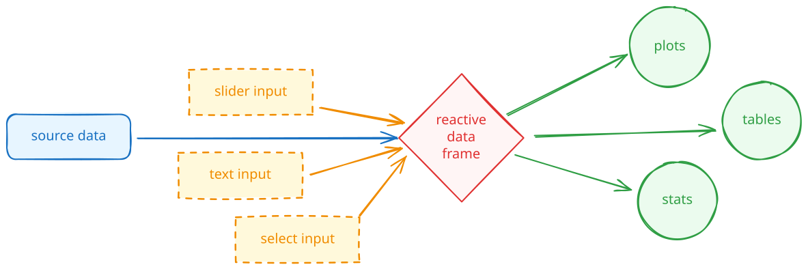
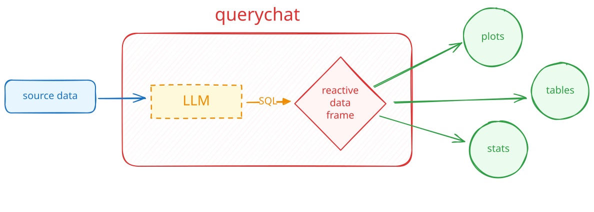
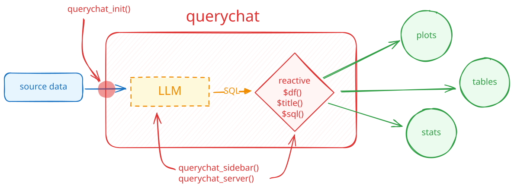

# [querychat]{.hidden} {.no-invert-dark-mode .center background-image="assets/robot-querychat.jpg" background-size="cover" background-position="center"}

## {.center .tc transition="fade"}



## {.center .tc transition="fade"}



## {.center .tc transition="fade"}



## querychat in R

```{.r .scrollable code-line-numbers="|3|5|8|13|8,13|15-17"}
library(shiny)
library(bslib)
library(ellmer)
library(querychat)

mtcars_qc <- QueryChat$new(mtcars, client = chat_posit())

ui <- page_sidebar(
  sidebar = mtcars_qc$sidebar(),
  # plots, tables, etc.
)

server <- function(input, output, session) {
  mtcars_qc_vals <- mtcars_qc$server()

  output$table <- renderTable({
    mtcars_qc_vals$df()
  })
}

shinyApp(ui, server)
```

## querychat in Python

```{.python .scrollable code-line-numbers="|2|5-7|10|15|10,15|17-19"}
import polars as pl
import querychat
from chatlas import ChatPosit
from shiny import App, render, ui

mtcars = pl.read_csv("data/mtcars.csv")

mtcars_qc = querychat.QueryChat(mtcars, "mtcars", client=ChatPosit())

app_ui = ui.page_sidebar(
    mtcars_qc.sidebar(),
    # plots, tables, etc.
)

def server(input, output, session):
    mtcars_qc_vals = mtcars_qc.server()

    @render.data_frame
    def data_table():
        return mtcars_qc_vals.df()

app = App(app_ui, server)
```

# Your Turn `26_querychat` {.slide-your-turn}

1. I've made a Shiny dashboard to explore Airbnb listings in Austin, TX.
   * Spend 1-2 min: which Neighborhood has most private rooms?

1. Work through the steps in the comments to use `querychat`.

1. Spend a few minutes exploring the data and chatting with the app. \
   Which area has the most private rooms?



<!-- TODO: New shinychat section (page_chat and v0.5.0 features) -->
